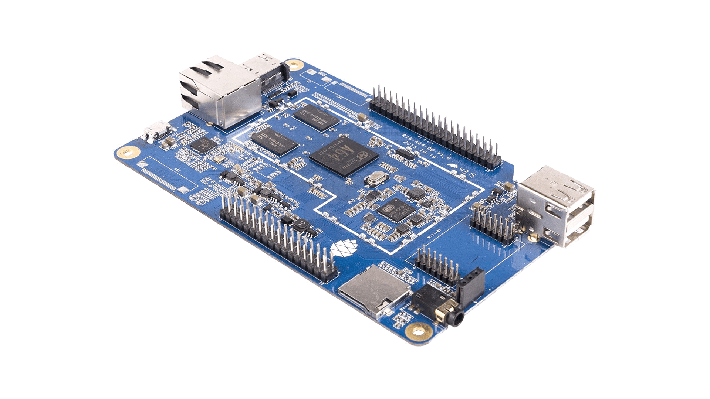

# fura64
Random stuff for the original 2016 Pine64 A65, with LCD. 
I've tried many times to make something useful with this thing but I alway struggle to find the resources I need, so I decided to collect my findings here, as I go along.



I might, however, turn this ino something more specific if I find a use case that works well for this device. I planned to use this for my ["Smart Doorbell"](https://github.com/d00astro/pintu) project, but I didn't have much luck with the GPIOs on this thing (using Python at least), so I think I won't even bother with that, and just use a normal Raspberry Pi instead.

## Armbian Version
The Pine64 A64(+) LCD does not seem to work with any Linux (pine?) kernels newer than 3.10 so I recommend using [`Armbian_5.90_Pine64_Ubuntu_xenial_default_3.10.107_desktop`](https://archive.armbian.com/pine64/archive/Armbian_5.90_Pine64_Ubuntu_xenial_default_3.10.107_desktop.7z )

## Getting the LCD and Touchscreen to work
1. Edit the file `/boot/armbianEnv.txt`, setting `pine64_lcd=on` instead of `off`.;
2. Edit the file `/etc/modules`, adding a line with `gt9xxf_ts` 

## Getting the LCD to maximum brightness
Run the script `max_lcd_brightness`, it can be set to run automaticall on startup by adding the `maxlcd.desktop` file to `~/.config/autostart`

## Python 3.8
Somewhere, eg in `~/Downloads/` , and as root (or using `sudo`, depending on debian flavor) run the following to install Python 3.8
```
apt install libffi-dev libbz2-dev liblzma-dev libsqlite3-dev libncurses5-dev libgdbm-dev zlib1g-dev libreadline-dev libssl-dev tk-dev build-essential libncursesw5-dev libc6-dev openssl git;
wget https://www.python.org/ftp/python/3.8.0/Python-3.8.0.tar.xz
tar xf Python-3.8.0.tar.xz
cd cpython-3.8*
./configure --prefix=$HOME/.local --enable-optimizations --disable-profiling
make -j -l 4
make altinstall
cd ..
rm -r Python-3.8.0
rm Python-3.8.0.tar.xz
```

Then add to `~/.bashrc`:
```
export PATH=$HOME/.local/bin/:$PATH
```

## Python GPIO control
I don't think this ever worked completely for me, but still.

Somewhere, e.g. in `~/Downloads/`:
```
git clone https://github.com/swkim01/RPi.GPIO-PineA64.git
cd RPi.GPIO-PineA64
sudo python setup.py install
sudo chmod -R $USER:$USER ./
```

Then add to `~/.bashrc`:
```
export PYTHONPATH=$HOME/Downloads/RPi.GPIO-PineA64/:$PYTHONPATH
```
Adjust for installation dir, if not `Downloads`.

I had various issues with this, most lately that importing `RPi.GPIO` gives an error that it's unable to find `RPi._GPIO` which I believe is the actual C-bindings. 
Somwhere I read that removing the underscore '_' from the file `RPi/GPIO/__init__.py`, i.e. changing the line `from RPi._GPIO import *` to `from RPi.GPIO import *`, would resolve this.
This seems like an odd fix to me, and while it indeed removed the error, it didn't seem to actually import the module... which is maybe not that surprising, given the 'fix' :)


